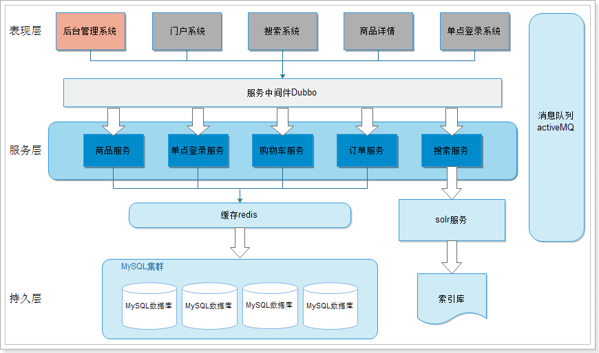

# taotao-shop-online
### 基于SSM框架电商商城

作为一个进阶的从SSM的crud到实际项目的练手项目，淘淘商城使用了以下技术：
- Spring、SpringMVC、Mybatis   基本框架
- MySQL  数据库
- Redis  缓存
- Nginx  反向代理、负载均衡
- Dubbo  服务发布和管理
- Zookeeper  服务注册中心
- Freemarker  页面静态化模板引擎
- FastDFS   图片服务器
- ActiveMQ   消息队列
- MyCat  数据库中间件
- HttpClient  Http协议访问客户端
- Quartz  定时任务
- Solr  搜索服务

整个淘淘商城是面向SOA架构的

